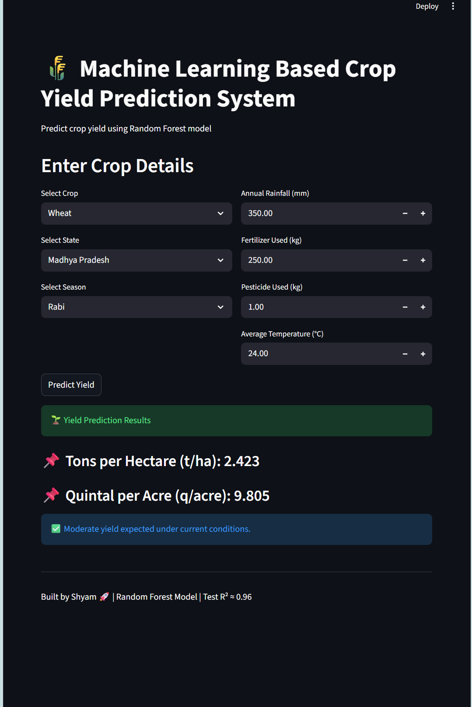

# 🌾 Crop Yield Prediction System

A Machine Learning based web application that predicts crop yield using environmental and agricultural factors like rainfall, temperature, fertilizer, and pesticide usage.

## 🚀 Features

- 🌱 Predict crop yield (tons/hectare & quintal/acre)
- 📊 Uses Random Forest ML model
- 🌍 Supports multiple crops, states, and seasons
- 🧠 Real-time prediction using Streamlit UI
- 📈 Clean and interactive interface

## 🧠 Machine Learning Model

- Algorithm: Random Forest Regressor
- Accuracy: R² ≈ 0.96
- Features Used:
  - Crop
  - State
  - Season
  - Annual Rainfall
  - Fertilizer Usage
  - Pesticide Usage
  - Average Temperature
  
## 📸 Output Preview

